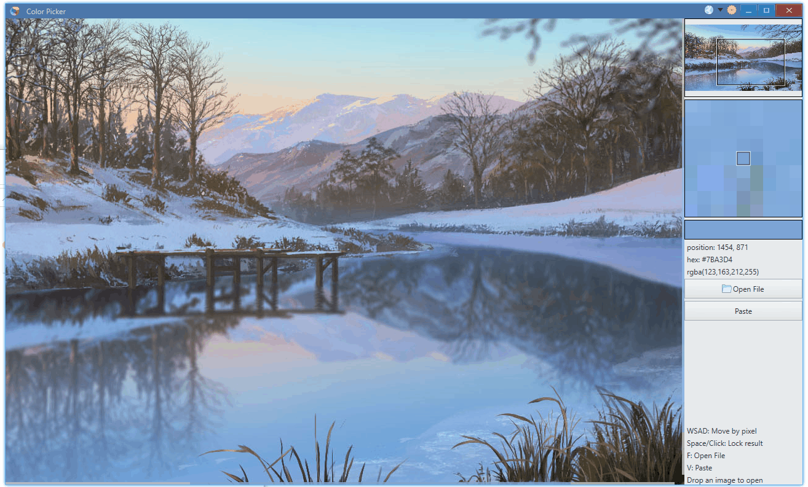
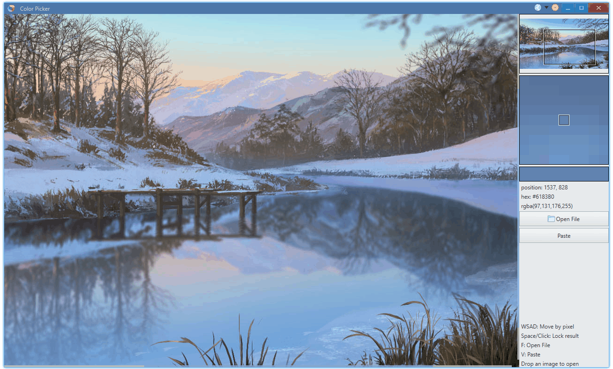

<p align="center">
    
</p>

<h1 align="center">颜色选择器</h1>

简体中文 | [English](./README.md)

# 简介

它是用 [Avernakis React](https://qber-soft.github.io/Ave-React-Docs/) 开发的！😀


麻雀虽小，五脏俱全。它包含以下功能：

-   基本控件：按钮、标签、图标、工具栏...
-   自定义控件：迷你视图、像素视图
-   鼠标事件、键盘事件
-   快捷键

-   拖拽释放



-   剪贴板


-   主题


-   国际化



# 安装

在这里下载: [Github Release](https://github.com/rerender2021/color-picker/releases)

## 开发

```bash
> npm install
> npm run dev
```

## 打包

```bash
> npm run release
```

## 开源协议

[MIT](./LICENSE)
